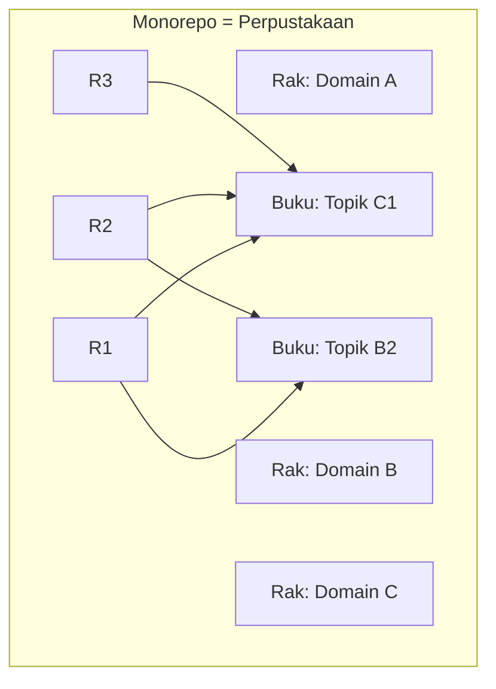

# Docs

Folder ini berisi seluruh dokumentasi lanjutan dan aturan monorepo.

## Konsep Monorepo (Analogi Perpustakaan)

- **Monorepo** = Perpustakaan
- **Rak** = Domain/tema besar
- **Buku** = Modul/topik spesifik di dalam rak

## Pemetaan

- [mapping.md](mapping.md)

## Tata Kelola

- [root-governance.md](root-governance.md)

## Catatan

`docs/` berisi penjelasan tambahan yang merujuk ke README di tiap level (root, rak, buku).

## Panduan Sumber Bab

- [chapter-sourcing.md](chapter-sourcing.md)

## Referensi

- [references.md](references.md)

## Pemetaan Referensi

- [reference-mapping.md](reference-mapping.md)

